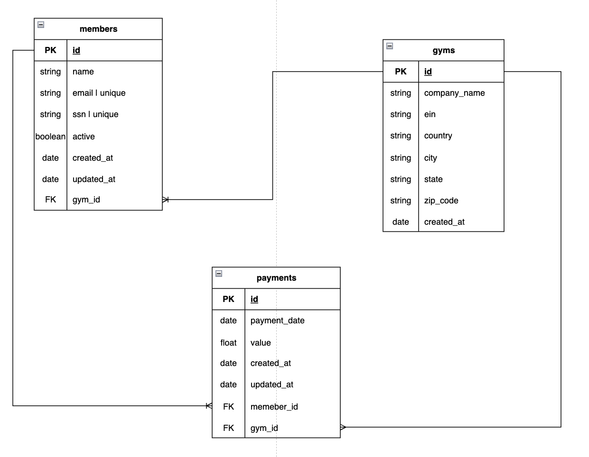

# Gym System Management

## Description

```
A project designed to assist in managing a gym by allowing registration and monitoring of member membership payments.
```

## Requirements

### Functional Requirements

- It should be possible to register a gym.

- It should be possible to register a member.

- It should be possible to record a payment for a member.

- It should be possible to retrieve data from a logged-in gym.

- It should be possible to deactivate a member.

- It should be possible to list all members.

- It should be possible to retrieve details of a single member.

- It should be possible to list all paid and unpaid membership fees of a member.

- It should be possible to view all paid membership fees for the month.

- It should be possible to view all unpaid membership fees for the month.

- It should be possible to calculate the total revenue received in a month.

- It should be possible to view the total outstanding amount yet to be received.

### Non-Functional Requirements

- A member can only have one registered email.

- Each gym can only have one registered CNPJ.

- When registering a member, 12 installments should be created for the membership fee.

- All financial operations and member listings must include active members.

- There should be an option to view inactive members as well.

### Technical Requirements

- The gym password must be encrypted.

- Data will be stored in PostgreSQL.

- The project will be developed using Node.js.

- The project will use fastify framework, zod for validation

- The gym should be authenticated using a JWT token.

## Project

### Database Diagram
